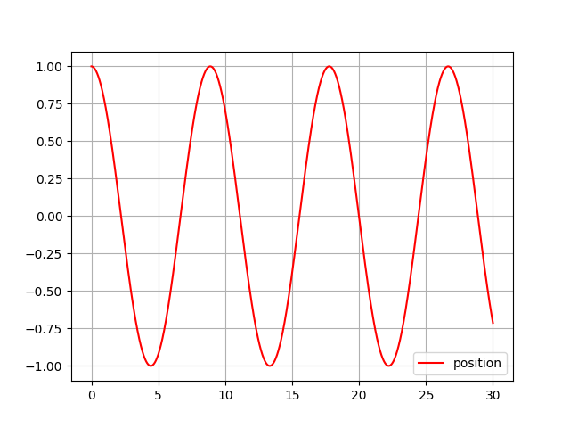

By using rungekunta method we can solve the differential equations without any integration.

$m\frac{d^2x}{dt^2}+c\frac{dx}{dt}+kx=F(t)$

Here is the result of x with time interval=0.001

[0.001, 0.00200085, 0.0030025493725000002, 0.0040050974896691256, 0.005008493723345989, 0.006012737445039057, 0.007017828025927008, 0.008023764836859104, 

...

0.9325510828573946, 0.9339921887216353, 0.9354336121444549, 0.9368753523576667, 0.9383174085930405, 0.9397597800823028, 0.9412024660571373, 
0.9426454657491856, 0.9440887783900471, 0.9455324032112796, 0.9469763394443997, 0.94842]

